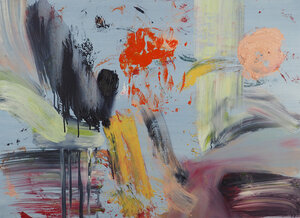

## About

     

          

               
          

          
Satellites, oil on paper, 90 cm x 70.5 cm (framed)
          

     

## Bio

Melissa is a painter and art educator, with a Bachelor of Art Education from NSW University Sydney, and an MFA from Bath Spa University, UK. and she currently teaches Painting and Drawing at Bath College. 

Mark-making, and the materiality of the paint itself, have always been central to her painting practice, exploring the boundaries of control and chance. Her work has recently evolved from expressionist figurative paintings to intensely coloured gestural abstraction. 

Melissa is a 44AD Associate artist, and she co-curated Laura’s Place, in 2014. She also exhibits with Fringe Arts Bath and has curated two FaB shows, Photo:Paint in 2014 and TimeFrame in 2016. Melissa has work in private collections in Australia, Canada and the UK.

## Media / Links

[Deviation Street Interview](https://deviationstreetmagazine.com/into-abstraction-kate-burbridge-interview-with-melissa-wraxall/)

[Somerset Art Works](https://somersetartworks.org.uk/artists/melissa-temple-smith/)

[Spike Island Associates](https://www.spikeisland.org.uk/our-community/spike-island-associates/)

[44AD artspace](http://www.44ad.net/associate-artists.html)

