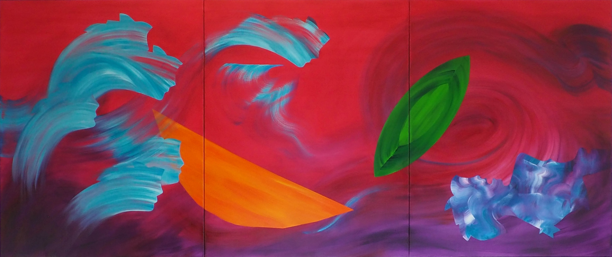

     

          

               
          

          
 Between Scylla and Charybdis
     Oil on canvas
     150cm x 360cm
          

     

# Statement

These abstract oil paintings exist as new and unique objects, untethered to objective reality. Every mark or gesture is a trace of a movement in time, with forms appearing to float, zip and dance around each other through an unlimited space. 

My methodology embraces chance and improvisation, using unconventional implements, such as plastering tools and used packaging, alongside brushes and palette knives. Each painting is built up in a series of layers, intuitively juxtaposing saturated colours, with textures ranging from translucent glazes to thickly rendered impasto. I choose when to keep unexpected results, and when to shape or alter the outcome. Sometimes colour is wiped back or abraded, and these acts of destruction often form an important element in the history and character of the painting. 

While there is no preconceived subject matter in my paintings, our brains have evolved to find meaning, pattern or form in things which seem random and incomprehensible. For millennia we have interpreted constellations of stars as mythological gods, or seen faces, creatures and objects in the clouds on a sunny day. Visual elements which emerge as the work takes shape, often suggest a title, although these are not intended to describe, impose or limit meaning. Rather, the viewer is invited to make free associations and interpretations of the paintings, using their own experiences and creative imagination. 

©2025 Melissa Wraxall 

# Bio

Melissa Wraxall is a contemporary painter, based in Bath, with an MFA from Bath Spa University, UK, and a Bachelor of Art Education from the City Art Institute, Sydney, Australia. 
Painting and drawing form the core of Melissa’s practice, with a current focus on gestural abstraction. Her background in education, at both Secondary and Further Education levels, has informed and complemented her own development as an artist. Mark-making, and the materiality of the paint itself, have always been central to her methodology, exploring the boundaries of control and chance. 

Melissa has had several solo shows including “Vivid”, at Burdall’s Yard, Bath, and by invitation, “Throwing Shapes” at Pound Arts Centre, Corsham.  She has exhibited in numerous group shows in the South West of England, most notably at the Tremenheere Gallery in Cornwall, The Bath School of Art and Design’s Alumni Show and at the RWA Artist Network Show in Bristol. 

Formerly a 44AD studio artist, Melissa regularly exhibits at 44AD as an Associate artist. She has exhibited with the Newlyn Society of Artists, Widcombe Arts Trail, Bath Open Studios and Fringe Arts Bath. She has curated two group shows for Fringe Arts Bath and one for 44AD. She is a member of the RWA Artist Network, Somerset Artworks and the Bath Art Circle. Three of her works are on exhibition at the Sulis Hospital Bath, and she has recently joined Gallery Nine in Bath. Melissa also has work in private collections in the UK, Canada and Australia.

## Media / Links

Email: melissa.wraxall@gmail.com

[RWA Artist Network](https://www.rwa.org.uk/blogs/artists/melissa-wraxall)

[Somerset Art Works](https://somersetartworks.org.uk/artists/melissa-temple-smith/)

[44AD artspace](http://www.44ad.net/associate-artists.html)

