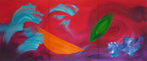

     

          

               
          

          
 Between Scylla and Charybdis
     Oil on canvas
     150cm x 360cm
          

     

# Statement

Making these intensely coloured abstractions represents for me, a kind of conceptual or imaginative freedom and a sense of hope. These expressionist paintings and drawings, exist as new and unique objects, untethered to objective reality. However, every mark is a trace of a real movement in time, and I often aim for a playful sense of hide and seek, with forms floating, zipping and dancing around each other through an unlimited space.

I often start with no preconceived notion of what the finished work will look like, embracing chance and improvisation. Decisions about what to apply next onto a given work, are made in an intuitive way, juxtaposing often strongly contrasting colours. These are derived from the dazzling and seductive palette of the digital environment, as well as those attention-seeking pigments in the natural world, used as warnings, or to attract pollinators or prey.

The complexity of microscopic worlds, images of vast galaxies outside our solar system, or rock patterns formed millions of years ago in a cliff face are the kinds of visual cues which inform the shapes and forms in my work. Although there is no subject matter per se in my paintings, I think we are evolved to find meaning, pattern or form in things which seem random and incomprehensible, like seeing mythological gods in constellations of stars, or faces, creatures and objects in the clouds on a sunny day.

Gesture is an integral part of my practice, and my methodology is experimental, using unconventional tools alongside brushes and palette knives. This produces a range of textures from scumbled or scratched surfaces, or translucent glazes, to thickly rendered impasto. Each application of colour can highlight or partially conceal, what has been applied before. I choose when to allow the drips and runs, when to keep an unexpected result, and when to shape or alter the outcome. Sometimes colour is wiped or abraded back, and these acts of destruction can often form an important element in the history and character of the work. I work on a range of surfaces, from installation multiples of tiny five- by five-centimetre paintings on angled blocks of pine, to larger works on wood panels, paper and canvas.

The titles of these paintings are free associations sometimes derived from visual elements of the works which emerge as they take shape. These titles could be related to subjects as diverse as biology, astronomy, culture, technology or politics, but rather than being illustrative, my work is primarily an exploration of colour, and the material possibilities of oil paint. My main intention is to invite the viewer to immerse themselves in colour and form, and as with music, to experience a sense of emotion and imaginative freedom. 

©2023 Melissa Wraxall 

# Bio

Melissa is a painter and art educator, with a Bachelor of Art Education from NSW University, Sydney, and an MFA from Bath Spa University, UK.  

Mark-making, and the materiality of the paint itself, have always been central to her painting practice, exploring the boundaries of control and chance. Her work has recently evolved from expressionist figurative paintings to intensely coloured gestural abstraction. 

Melissa is a 44AD Associate artist, and she co-curated Laura’s Place, in 2014. She also exhibits with Fringe Arts Bath and has curated two FaB shows, Photo:Paint in 2014 and TimeFrame in 2016. Melissa has work in private collections in Australia, Canada and the UK.

## Media / Links

Email: melissa.wraxall@gmail.com

[RWA Artist Network](https://www.rwa.org.uk/blogs/artists/melissa-wraxall)

[Somerset Art Works](https://somersetartworks.org.uk/artists/melissa-temple-smith/)

[44AD artspace](http://www.44ad.net/associate-artists.html)

[Cultivate Gallery Next(Au Suivant) online show](https://organthing.com/2021/04/20/cultivate-presents-next-au-suivant-an-on-line-art-exhibition/)

[ReCultivate](https://organthing.com/2021/01/05/cultivate-presents-recultivate-an-on-line-art-exhibition/)

[Deviation Street Interview](https://deviationstreetmagazine.com/into-abstraction-kate-burbridge-interview-with-melissa-wraxall/)

