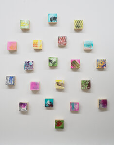

## Gallery
 
 
All artworks are available for purchase unless indicated otherwise, and all enquiries, including prices, can be made by emailing melissa.wraxall@gmail.com. Where a link is provided, some works can also be viewed or purchased through Saatchi Online.

### 2019

### Ned

### Flux

## Pixels 

Twenty tiny pastel and graphite drawings on wood. Like Flux, the forward facing surfaces of each of the wooden blocks are slightly angled. Pixels was originally conceived as an installation, but because of the delicate nature of the media used, the work was framed and glazed as one work.

### 2020

